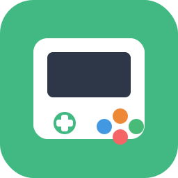

<h1 align="center">
  
   
  Hello Game
</h1>

    
    
    
    
    

一个寓教于乐的儿童游戏平台，集合经典益智游戏与趣味早教学习，帮助小朋友在游戏中快乐成长。

## ✨ 功能特色

### 🎯 经典益智

| 游戏      | 说明                             |
|---------|--------------------------------|
| 💣 扫雷   | 经典扫雷游戏，锻炼逻辑推理能力                |
| 🔢 数独   | 支持 4×4 到 9×9 多种规格，简单/中等/困难三种难度 |
| 🧩 2048 | 滑动合并数字，挑战最高分                   |
| 🀄 消消乐  | 配对消除游戏，支持语文、数学、英语三种模式          |

### 🌟 趣味早教

| 游戏      | 说明                 |
|---------|--------------------|
| 📝 识字达人 | 看图识字，涵盖小学一年级常用汉字   |
| 🎵 拼音学习 | 声母韵母趣味学习，打好拼音基础    |
| 🌍 英语启蒙 | 趣味英语单词学习，涵盖小学一年级词汇 |
| ➕ 加减乐园  | 趣味加减法练习，支持多种难度     |

### 📋 通用功能

- **计时系统**：所有教育游戏支持计时，记录学习用时
- **题目数量选择**：5/10/15/20/30 题自由选择
- **自由出题**：支持搜索题库，动态添加自定义题目
- **难度分级**：简单/中等/困难，适应不同学习阶段

## 🎨 设计理念

- **寓教于乐**：将学习内容融入游戏机制，让孩子在玩中学
- **渐进难度**：从简单到困难，适应不同年龄段和能力水平
- **视觉友好**：使用柔和配色和圆润设计，适合儿童使用
- **即时反馈**：答题即时反馈对错，增强学习效果
- **自由定制**：支持自定义题目和数量，满足个性化学习需求

## 许可证

Apache License 2.0

---

  

